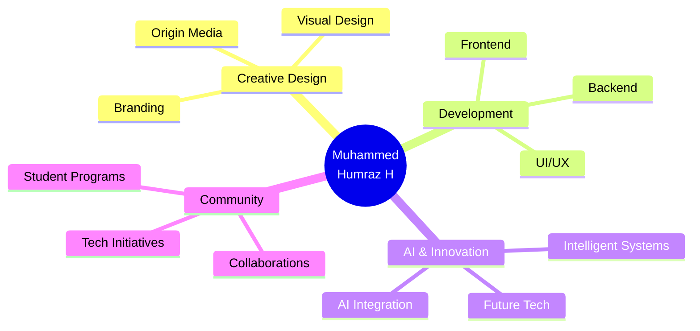

<!-- Animated Gradient Banner -->

  

<!-- Your existing banner GIF (optional - can remove if using above) -->
<!-- 

  

 -->

  

  
  
  

  
  `/* Turning ideas into interactive reality */`
  

 ---
### 💫 About Me

  

 

<table align="center">
  <tr>
    <td width="60%">
      <b>👨‍💻 I'm a BCA student</b> passionate about blending creativity, technology, and innovation to build impactful digital experiences and community-driven projects.
        
      🎯 <b>My journey</b> started with creative design and gradually expanded into frontend development, backend systems, AI integrations, and real-world problem solving.
        
      🌍 <b>Beyond development</b>, I actively organize tech initiatives, student programs, and collaborative projects while exploring the future of AI and modern web technologies.
    </td>
    <td width="40%" align="center">
      
    </td>
  </tr>
</table>

---

### ✨ What Drives Me

  <table>
    <tr>
      <td align="center" width="33%">
        
         
        Founder & Creative Visionary
      </td>
      <td align="center" width="33%">
        
         
        Building Intelligent Systems
      </td>
      <td align="center" width="33%">
        
         
        Student Initiatives Lead
      </td>
    </tr>
  </table>

---

### 🎯 Core Focus Areas

---

## Current Journey

  
  
  

  

  <code>🎨 Design → 💻 Code → 🤖 AI → 🌍 Impact</code>

---

## My Philosophy

  

---

### 🛠️ Tech Stack

| Category | Tools & Technologies |
| :--- | :--- |
| **Frontend** |           |
| **Backend** |        |
| **AI / ML** |     |
| **Design & Creative** |    |
| **Tools / Cloud** |       |

---

### 📊 GitHub Analytics

  

  

          

  

---

### 🐍 Contribution Journey

  

  

               

  <picture>
    <source media="(prefers-color-scheme: dark)" srcset="https://raw.githubusercontent.com/mhd-humraz/mhd-humraz/output/github-snake-dark.svg" />
    <source media="(prefers-color-scheme: light)" srcset="https://raw.githubusercontent.com/mhd-humraz/mhd-humraz/output/github-snake.svg" />
    
  </picture>

---

### 📫 Connect with Me

 
  

